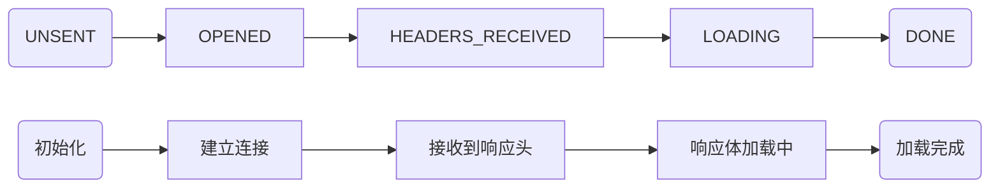

# AJAX

## 概述：

> Web 程序最初的目的就是将信息（数据）放到公共的服务器，让所有网络用户都可以通过浏览器访问。

在此之前，我们可以通过以下几种方式让浏览器发出对服务端的请求，获得服务端的数据：

- 地址栏输入地址，回车，刷新
- 特定元素的 href 或 src 属性
- 表单提交

这些方案都是我们无法通过或者很难通过代码的方式进行编程（对服务端发出请求并且接受服务端返回的响应），
**如果我们可以通过 JavaScript  直接发送网络请求，那么 Web  的可能就会更多，随之能够实现的功能也会更多，至少不再是“ 单机游戏”.**

AJAX（Asynchronous JavaScript and XML），最早出现在 2005 年的 Google Suggest，是在浏览器端进行网络编程（发送请求、接收响应）的技术方案，它使我们可以通过 JavaScript 直接获取服务端最新的内容而不必重新加载页面。让 Web 更能接近桌面应用的用户体验。

说白了，**AJAX  就是浏览器提供的一套 API ，可以通过 JavaScript  调用，从而实现通过代码控制请求与响应。实现网络编程**

## 起步：

使用 AJAX 的过程可以类比平常我们访问网页过程

``` js
// 1. 创建一个 XMLHttpRequest 类型的对象 —— 相当于打开了一个浏览器
var xhr = new XMLHttpRequest();

// 2. 打开与一个网址之间的连接 —— 相当于在地址栏输入访问地址
xhr.open('GET','http://answer05.zf/time.php');	// 设置请求行

xhr.setRequestHeader('Foo', 'Bar');				// 设置请求头

// 3. 通过连接发送一次请求 —— 相当于回车或者点击访问发送请求
// POST请求必须设置
// xhr.setRequestHeader('Contetn-Type', 'application/x-www-from-urlencord'); 
xhr.send(null);


// 4. 指定 xhr 状态变化事件处理函数 —— 相当于处理网页呈现后的操作
// 一般不建议用on 注册事件容易出现覆盖
// xhr.onreadystatechange = function(){
xhr.addEventListener('readystatechange', function() {
  
  // 通过 xhr 的 readyState 判断此次请求的响应是否接收完成
	if (this.readyState !== 4) return;
  
  // 通过 xhr 的 responseText 获取到响应的响应体
  var data = JSON.parse(this.responseText)
	// console.log(this.responseText)             	获取响应体内容
	// console.log(this.getAllResponseHeaders());	获取响应头内容	
});

```

- `response`     	获取的结果会根据 `this.responseType`的变化而变化
- `responseText`    永远获取的是字符串的响应体

###  readyState

由于  `readystatechange` 事件是在  `xhr` 对象状态变化时触发（不单是在得到响应时），也就意味着这个事件会被触发多次，所以我们有必要了解每一个状态值代表的含义：

| readyState | 状态描述         | 说明                                                      |
| ---------- | ---------------- | --------------------------------------------------------- |
| 0          | UNSENT           | 代理`（XHR）`被创建，但尚未调用  open() 方法。            |
| 1          | OPENED           | `open()` 方法已经被调用，建立了连接。                     |
| 2          | HEADERS_RECEIVED | `send()` 方法已经被调用，并且已经可以获取状态行和响应头。 |
| 3          | LOADING          | 响应体下载中，  `responseText` 属性可能已经包含部分数据。 |
| 4          | DONE             | 响应体下载完成，可以直接使用  `responseText` 。           |

#### 时间轴



```js
var xhr = new XMLHttpRequest()
console.log(xhr.readyState)
// => 0
// 初始化 请求代理对象
xhr.open('GET', 'time.php')
console.log(xhr.readyState)
// => 1
// open 方法已经调用，建立一个与服务端特定端口的连接
xhr.send()
xhr.addEventListener('readystatechange', function () {
  switch (this.readyState) {
    case 2:
      // => 2
      // 已经接受到了响应报文的响应头
      // 可以拿到头
      // console.log(this.getAllResponseHeaders())
      console.log(this.getResponseHeader('server'))
      // 但是还没有拿到体
      console.log(this.responseText)
      break
    case 3:
      // => 3
      // 正在下载响应报文的响应体，有可能响应体为空，也有可能不完整
      // 在这里处理响应体不保险（不可靠）
      console.log(this.responseText)
      break
    case 4:
      // => 4
      // 一切 OK （整个响应报文已经完整下载下来了）
      // 这里处理响应体
      console.log(this.responseText)
      break
  }
})
```

通过理解每一个状态值的含义得出一个结论：一般我们都是在  readyState 值为  4 时，执行响应的后续逻辑。


#### 遵循 HTTP

本质上 XMLHttpRequest 就是 JavaScript 在 Web 平台中发送 HTTP 请求的手段，所以我们发送出去的请求任然是HTTP 请求，同样符合 HTTP 约定的格式：

```js
// 设置请求报文的请求行
xhr.open('GET', './time.php')
// 设置请求头
xhr.setRequestHeader('Accept', 'text/plain')
// 设置请求体
xhr.send(null)
xhr.onreadystatechange = function () {
  if (this.readyState === 4) {
    // 获取响应状态码
    console.log(this.status)
    // 获取响应状态描述
    console.log(this.statusText)
    // 获取响应头信息
    console.log(this.getResponseHeader('Content‐Type')) // 指定响应头
    console.log(this.getAllResponseHeader()) // 全部响应头
    // 获取响应体
    console.log(this.responseText) // 文本形式
    console.log(this.responseXML) // XML 形式，了解即可不用了
  }
}
```

> 参考链接：
> https://developer.mozilla.org/zh-CN/docs/Web/API/XMLHttpRequest
> https://developer.mozilla.org/zh-CN/docs/Web/API/XMLHttpRequest/Using_XMLHttpRequest

## 使用

### GET

通常在一次 GET 请求过程中，参数传递都是通过 URL 地址中的  `?` 参数传递

```js
var xhr = new XMLHttpRequest()
// GET 请求传递参数通常使用的是问号传参
// 这里可以在请求地址后面加上参数，从而传递数据到服务端
xhr.open('GET', './delete.php?id=1')
// 一般在 GET 请求时无需设置响应体，可以传 null 或者干脆不传
xhr.send(null)
xhr.onreadystatechange = function () {
  if (this.readyState === 4) {
    console.log(this.responseText)
  }
}
// 一般情况下 URL 传递的都是参数性质的数据，而 POST 一般都是业务数据
```

### POST

POST 请求过程中，都是采用请求体承载需要提交的数据。

```js
var xhr = new XMLHttpRequest()
// open 方法的第一个参数的作用就是设置请求的 method
xhr.open('POST', './add.php')
// 设置请求头中的 Content‐Type 为 application/x‐www‐form‐urlencoded
// 标识此次请求的请求体格式为 urlencoded 以便于服务端接收数据
xhr.setRequestHeader('Content‐Type', 'application/x‐www‐form‐urlencoded')
// 需要提交到服务端的数据可以通过 send 方法的参数传递
// 格式：key1=value1&key2=value2
xhr.send('key1=value1&key2=value2')
xhr.onreadystatechange = function () {
  if (this.readyState === 4) {
    console.log(this.responseText)
  }
}
```

### 同步与异步

> 同步：一个人在同一个时刻只能做一件事情，在执行一些耗时的操作（不需要看管）不去做别的事，只是等
> 待
> 异步：在执行一些耗时的操作（不需要看管）去做别的事，而不是等待

`xhr.open()` 方法第三个参数要求传入的是一个  `bool` 值，其作用就是设置此次请求是否采用异步方式执行，默认
为  `true` ，如果需要同步执行可以通过传递  `false` 实现：

```js
console.log('before ajax')
var xhr = new XMLHttpRequest()
// 默认第三个参数为 true 意味着采用异步方式执行
xhr.open('GET', './time.php', true)
xhr.send(null)
xhr.onreadystatechange = function () {
  if (this.readyState === 4) {
    // 这里的代码最后执行
    console.log('request done')
  }
}
console.log('after ajax')
```

如果采用同步方式执行，则代码会卡死在  `xhr.send()` 这一步：

```js
console.log('before ajax')
var xhr = new XMLHttpRequest()
// 同步方式
xhr.open('GET', './time.php', false)
// 同步方式 执行需要 先注册事件再调用 send，否则 readystatechange 无法触发
xhr.onreadystatechange = function () {
  if (this.readyState === 4) {
    // 这里的代码最后执行
    console.log('request done')
  }
}
xhr.send(null)
console.log('after ajax')
```

演示同步异步差异。

一定在发送请求  `send()` 之前注册  `readystatechange` （不管同步或者异步）

- 为了让这个事件可以更加可靠（一定触发），一定是先注册
  

###  响应数据格式

#### XML

一种数据描述手段，基本现在的项目不用了。
淘汰的原因：数据冗余太多

#### JSON

也是一种数据描述手段，类似于 JavaScript 字面量方式
服务端采用 JSON 格式返回数据，客户端按照 JSON 格式解析数据

###  兼容方案

XMLHttpRequest 在老版本浏览器（IE5/6）中有兼容问题，可以通过另外一种方式代替

```js
var xhr = window.XMLHttpRequest ? new XMLHttpRequest() : new ActiveXObject('Microsoft.XMLHTTP') 
```

## 封装

> 函数就可以理解为一个想要做的事情，函数体中约定了这件事情做的过程，直到调用时才开始工作。
> 将函数作为参数传递就像是将一个事情交给别人，这就是委托的概念

```js
/**
 * 发送一个 AJAX 请求
 * @param  {String}   method 请求方法
 * @param  {String}   url    请求地址
 * @param  {Object}   params 请求参数
 * @param  {Function} done   请求完成过后需要做的事情（委托/回调）
 */
function ajax (method, url, params, done) {
  // 统一转换为大写便于后续判断
  method = method.toUpperCase()
  // 对象形式的参数转换为 urlencoded 格式
  var pairs = []
  for (var key in params) {
    pairs.push(key + '=' + params[key])
  }
  var querystring = pairs.join('&')
  var xhr = window.XMLHttpRequest ? new XMLHttpRequest() : new
ActiveXObject('Microsoft.XMLHTTP')
  xhr.addEventListener('readystatechange', function () {
    if (this.readyState !== 4) return
    // 尝试通过 JSON 格式解析响应体
    try {
      done(JSON.parse(this.responseText))
    } catch (e) {
      done(this.responseText)
    }
  })
  // 如果是 GET 请求就设置 URL 地址 问号参数
  if (method === 'GET') {
    url += '?' + querystring
  }
  xhr.open(method, url)
  // 如果是 POST 请求就设置请求体
  var data = null
  if (method === 'POST') {
    xhr.setRequestHeader('Content‐Type', 'application/x‐www‐form‐urlencoded')
    data = querystring
  }
  xhr.send(data)
}

ajax('get', './get.php', { id: 123 }, function (data) {
  console.log(data)
})
ajax('post', './post.php', { foo: 'posted data' }, function (data) {
  console.log(data)
})
```

### jQuery 中的AJAX

 http://www.jquery123.com/category/ajax/


```js
$.ajax({
  url: './get.php',
  type: 'get',
  dataType: 'json',
  data: { id: 1 },
  beforeSend: function (xhr) {
    console.log('before send')
  },
  success: function (data) {
    console.log(data)
  },
  error: function (err) {
    console.log(err)
  },
  complete: function () {
    console.log('request completed')
  }
})
```

常用选项参数介绍：

- url：请求地址
- type：请求方法，默认为  get
- dataType：服务端响应数据类型

- contentType：请求体内容类型，默认  application/x-www-form-urlencoded
- data：需要传递到服务端的数据，如果 GET 则通过 URL 传递，如果 POST 则通过请求体传递
- timeout：请求超时时间
- beforeSend：请求发起之前触发
- success：请求成功之后触发（响应状态码 200）
- error：请求失败触发
- complete：请求完成触发（不管成功与否）

#### 快捷方法

```js

// 快捷方法
$.get( url [, data ] [, success(data, textStatus, jqXHR) ] [, dataType ] )

$.post()

$.getJSON()

// 全局 Ajax 事件处理器
$(document).ajaxStart(function(){   
})
$(document).ajaxStop(function(){
})

```


#### 示例：

```html
<!-- 前提载入 -->
<link rel="stylesheet" type="text/css" href="/css/nprogress.css">
<script src="/js/nprogress.js"></script>
<!-- 独立作用域确保页面加载完成执行 -->
<script>
	$(function($){       
	  // 全局事件处理函数
	  $(document)
	    .ajaxStart(function(){
	      NProgress.start()
	    })
	    .ajaxStop(function(){
	      NProgress.done()        
	  })
	  // 局部页面响应以及渲染
	  $('.list-group-item').on('click', function() {
	      var href = $(this).attr('href')
	      $('#main').load(href + ' #main > *')
	      return false
	  });      
	})
</script>
```


## AJAX 异步上传文件

```js

## 客户端操作

$('#avatar').on('change',function(){

   $this = $(this)

   var files = $this.prop('files')

   if(!files.length) return

   var file = files[0]

   // h5新增的 专门配合ajax操作，用于客户端服务端间传递二进制数据
   var data = new FormData()

   data.append('avatar', file)

   var xhr = new XMLHttpRequest()

   xhr.open('POST','/admin/api/upload.php')

   xhr.send(data) // 借助 formdata 传递文件

   xhr.onload = function(){
     $this.siblings('img').attr('src',this.responseText)
     $this.siblings('input').val(this.responseText) // 界面添加隐藏域提交文件
   }
})

```

```php

## 服务端  

if(empty($_FILES['avatar'])){
	exit();
}
$avatar = $_FILES['avatar'];
if($avatar['error'] !== UPLOAD_ERR_OK){
	exit();
}
$ext = pathinfo($avatar['name'], PATHINFO_EXTENSION);
$target = '../../static/uploads/img-' . uniqid() . '.' . $ext;
if( !move_uploaded_file($avatar['tmp_name'], $target)){
	exit();
}
echo substr($target,5);

```


## AJAX Template


### artTemplate

- 创建 type =  type="text/x-art-template" 的script 标签 建立模板
- 使用代码引入模板引擎：var html = template('script 标签 id', {对象})

```html

<script type="text/x-art-template" id="tmpl">

	{{each comments}}

	<tr>
		<td>{{$value.author}}</td>
		<td>{{$value.content}}</td>
		<td>{{$value.created}}</td>
	</tr>
	
	{{/each}}

</script>

<script src="js/art-template.js"></script>

<script>
	
	xhr = new XMLHttpRequest()

	xhr.open('GET', '/php/text.php')

	xhr.send()

	xhr.setRequestHeader('Content-Type', 'application/x-www-form-urlencoded')

	xhr.onreadystatechange = function(){

		if(this.readyState !== 4) return
		var json = JSON.parse(this.responseText)
		var con = {comments: json.data}	  	//----------
		var html = template('tmpl', con)	//----------
		// console.log(html)
		var table = document.getElementById('table');
		table.innerHTML = html
		
	}

</script>

```


### jsrender

```html

<script src="/static/assets/vendors/jsrender/jsrender.min.js"></script>
<script id="comments_tmpl" type="text/x-jsrender">
 {{for comments}}
  <tr{{if status === 'approved'}} class="warning"{{else status === 'rejected'}} class="danger"{{/if}}>
   <td class="text-center"><input type="checkbox"></td>
   <td>{{:author}}</td>
   <td>{{:content}}</td>
   <td>《{{:title_name}}》</td>
   <td>{{:created}}</td>
   <td>{{if status === 'approved'}}批准{{else status === 'rejected'}}未批准{{else status === 'held'}}待审批{{/if}}</td>
   <td class="text-center">
    {{if status === 'held'}}
     <a href="post-add.html" class="btn btn-info btn-xs">批准</a>
     <a href="post-add.html" class="btn btn-warning btn-xs">驳回</a>
    {{/if}}
     <a href="javascript:;" class="btn btn-danger btn-xs">删除</a>
    </td>
   </tr>
 {{/for}}
</script>
<script>
 $.get('/admin/api/comments_select.php',function(res){
   var html = $('#comments_tmpl').render({ comments: res})
   $('#comments_tbody').html(html)
 })    
</script>

```


## 跨域

###  相关概念

同源策略是浏览器的一种安全策略
所谓同源是指域名，协议，端口完全相同，只有同源的地址才可以相互通过
AJAX 的方式请求。
同源或者不同源说的是两个地址之间的关系，不同源地址之间请求称之为**跨域请求**

| 对比地址                                 | 是否同源 | 理由           |
| ---------------------------------------- | -------- | -------------- |
| http://api.example.com/detail.html       | 不同源   | 域名不同       |
| https://www.example.com/detail.html      | 不同源   | 协议不同       |
| http://www.example.com:8080/detail.html  | 不同源   | 端口不同       |
| http://api.example.com:8080/detail.html  | 不同源   | 域名、端口不同 |
| https://api.example.com/detail.html      | 不同源   | 协议、域名不同 |
| https://www.example.com:8080/detail.html | 不同源   | 端口、协议不同 |
| http://www.example.com/other.html        | 同源     | 只是目录不同   |

### JSONP

`JSON with Padding`，是一种借助于  script 标签发送跨域请求的技巧。
其原理就是在客户端借助  script 标签请求服务端的一个动态网页（php 文件），服务端的这个动态网页返回一
段带有函数调用的 JavaScript 全局函数调用的脚本，将原本需要返回给客户端的数据传递进去。
以后绝大多数情况都是采用 JSONP 的手段完成不同源地址之间的跨域请求

```html
<script src="url"></script> 
```

**总结**：由于 XMLHttpRequest 无法发送不同源地址之间的跨域请求，所以我们必须要另寻他法，script 这种方案就是我们最终选择的方式，我们把这种方式称之为 JSONP，如果你不了解原理，先记住怎么用，多用一段时间再来看原理。

#### JSONP基础

客户端：

```html
<script>
	function a(data){
		console.log(data)
  }
</script>
<script src="http://127.0.0.1:3000/?callback=a"></script>
```

服务端(node为例)：

```js
...
res.end(`${req.query.callback}(${data})`)
...
```


#### JSONP 跨域请求底层源码

```js

## 客户端

//JSONP 封装
function jsonp (url, params, callback) {
  var funcName = 'jsonp_' + Date.now() + Math.random().toString().substr(2, 5)

  if (typeof params === 'object') {
    var tempArr = []
    for (var key in params) {
      var value = params[key]
      tempArr.push(key + '=' + value)
    }
    params = tempArr.join('&')
  }

  var script = document.createElement('script')
  script.src = url + '?' + params + '&callback=' + funcName
  document.body.appendChild(script)

  window[funcName] = function (data) {
    callback(data)

    delete window[funcName]
    document.body.removeChild(script)
  }
}

```

```php

## 服务端

$conn = mysqli_connect('localhost', 'root', '123456', 'demo');

$query = mysqli_query($conn, 'select * from users');

while ($row = mysqli_fetch_assoc($query)) {
  $data[] = $row;
}

if (empty($_GET['callback'])) {
  header('Content-Type: application/json');
  echo json_encode($data);
  exit();
}

// 如果客户端采用的是 script 标记对我发送的请求
// 一定要返回一段 JavaScript
header('Content-Type: application/javascript');
$result = json_encode($data);

$callback_name = $_GET['callback'];
echo "typeof {$callback_name} === 'function' && {$callback_name}({$result})";

```


#### AJAX发送JSONP请求

```js

$.ajax({
  url: 'http://localhost/jsonp/server.php',
  dataType: 'jsonp',
  success: function (res) {
    console.log(res)
  }
})

// 即 dataType 参数设置为 jsonp 即可
// 只能发GET请求
```


#### 服务端解决跨域问题

```php

## 服务端加响应头即可 （存在兼容问题）
header('Access-Control-Allow-Origin: *');   // * 通配所有源 也可以指定源 加网址即可

```


